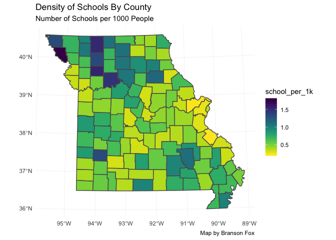

Lab-10-Replication
================
Branson Fox
(March 30, 2019)

## Introduction

This notebook replicates the results for lab-10 - Density of Public
Schools in Missouri.

## Dependencies

This notebook requires the following packages to manipulate our data and
create maps.

``` r
# tidyverse packages
library(dplyr)   # methods for data manipulation
```

    ## 
    ## Attaching package: 'dplyr'

    ## The following objects are masked from 'package:stats':
    ## 
    ##     filter, lag

    ## The following objects are masked from 'package:base':
    ## 
    ##     intersect, setdiff, setequal, union

``` r
library(ggplot2) # making plots/maps

# other packages
library(sf)      # tools for spatial 
```

    ## Linking to GEOS 3.6.1, GDAL 2.1.3, PROJ 4.9.3

``` r
library(here)    # file path management
```

    ## here() starts at /Users/lawrence/Desktop/Lab-10-Replication

``` r
library(mapview) # interactive exploratory map
library(viridis) # accessible color palettes
```

    ## Loading required package: viridisLite

## Load Data

This notebook requires the K-12 Schools data and the County Population
data. Note the `crs = 4269` specified for schools. This is because the
original shapefile did not contain a coordinate system. Usually this
won’t be the case.

``` r
schools <- st_read(here("data","MO_EDU_PublicK12","MO_EDU_PublicK12.shp"),stringsAsFactors = FALSE, crs = 4269)
```

    ## Reading layer `MO_EDU_PublicK12' from data source `/Users/lawrence/Desktop/Lab-10-Replication/data/MO_EDU_PublicK12/MO_EDU_PublicK12.shp' using driver `ESRI Shapefile'
    ## Simple feature collection with 2381 features and 4 fields
    ## geometry type:  POINT
    ## dimension:      XY
    ## bbox:           xmin: -95.51797 ymin: 36.04236 xmax: -89.33608 ymax: 40.55136
    ## epsg (SRID):    4269
    ## proj4string:    +proj=longlat +ellps=GRS80 +towgs84=0,0,0,0,0,0,0 +no_defs

``` r
counties <- st_read(here("data","MO_DEMOS_CountyPop","MO_DEMOS_CountyPop.shp"), stringsAsFactors = FALSE)
```

    ## Reading layer `MO_DEMOS_CountyPop' from data source `/Users/lawrence/Desktop/Lab-10-Replication/data/MO_DEMOS_CountyPop/MO_DEMOS_CountyPop.shp' using driver `ESRI Shapefile'
    ## Simple feature collection with 115 features and 4 fields
    ## geometry type:  POLYGON
    ## dimension:      XY
    ## bbox:           xmin: -95.7747 ymin: 35.99568 xmax: -89.09897 ymax: 40.61364
    ## epsg (SRID):    4269
    ## proj4string:    +proj=longlat +datum=NAD83 +no_defs

## Part 1: Data Preparation

### Question 1

We’ll begin by checking that our data are in the same coordinate system.

``` r
st_crs(schools)
```

    ## Coordinate Reference System:
    ##   EPSG: 4269 
    ##   proj4string: "+proj=longlat +ellps=GRS80 +towgs84=0,0,0,0,0,0,0 +no_defs"

``` r
st_crs(counties)
```

    ## Coordinate Reference System:
    ##   EPSG: 4269 
    ##   proj4string: "+proj=longlat +datum=NAD83 +no_defs"

Our data are in the same coordinate system, but they need to be
projected to something appropriate for statewide Missouri data. We’ll
use UTM 15N, epsg 26915, because it captures most of the extent of
Missouri.

``` r
schools <- st_transform(schools, crs = 26915)
counties <- st_transform(counties, crs = 26915)
```

Next, we need to create a spatial join that identifies the county each
school is located in. We pipe into a select function in order to remove
the extra county variables.

``` r
schools_county <- st_intersection(schools, counties) %>%
  select(id, school, address, city, NAMELSAD)
```

    ## Warning: attribute variables are assumed to be spatially constant
    ## throughout all geometries

Next, we want to create a subset of schools in the City of Saint Louis.

``` r
stlSchools <- filter(schools_county, NAMELSAD == "St. Louis city")
```

Before exporting this we’ll preview the data we subset.

``` r
mapview(stlSchools)
```

<!-- -->

And since the data look good, we’ll save this to a new shapefile.

``` r
st_write(stlSchools, dsn = here("data","STL_EDU_PublicK12","STL_EDU_PublicK12.shp"), delete_dsn = TRUE)
```

    ## Deleting source `/Users/lawrence/Desktop/Lab-10-Replication/data/STL_EDU_PublicK12/STL_EDU_PublicK12.shp' using driver `ESRI Shapefile'
    ## Writing layer `STL_EDU_PublicK12' to data source `/Users/lawrence/Desktop/Lab-10-Replication/data/STL_EDU_PublicK12/STL_EDU_PublicK12.shp' using driver `ESRI Shapefile'
    ## features:       113
    ## fields:         5
    ## geometry type:  Point

We’ll do another spatial join, aggregating schools in all counties in
Missouri and combine them with county data.

``` r
# aggregate
schools_county %>%
  group_by(NAMELSAD) %>%
  summarise(schools = n()) -> schoolsByCounty

# remove geometry
st_geometry(schoolsByCounty) <- NULL

# join data
schoolsByCounty <- left_join(counties, schoolsByCounty, by = "NAMELSAD")
```

And now it’s ready to be written to a shapefile.

``` r
st_write(schoolsByCounty, dsn = here("data", "MO_EDU_County", "MO_EDU_County.shp"), delete_dsn = TRUE)
```

    ## Deleting source `/Users/lawrence/Desktop/Lab-10-Replication/data/MO_EDU_County/MO_EDU_County.shp' using driver `ESRI Shapefile'
    ## Writing layer `MO_EDU_County' to data source `/Users/lawrence/Desktop/Lab-10-Replication/data/MO_EDU_County/MO_EDU_County.shp' using driver `ESRI Shapefile'
    ## features:       115
    ## fields:         5
    ## geometry type:  Polygon

## Part 2: Mapping the Density of Schools in Missouri

This section may be completed in either `R` or `ArcGIS`. In this
replication, we’ll use `ggplot2`, but your results should be similar
regardless of the software used.

### Question 2

We’ll map the density of schools per square kilometer in each county.
First we need to calculate this number.

``` r
schoolsByCounty <- mutate(schoolsByCounty, school_density = schools/SQKM)
```

Then to create a choropleth map:

``` r
ggplot() +
  geom_sf(data = schoolsByCounty, mapping = aes(fill = school_density)) +
  theme_minimal() +
  labs(
    title = "Density of Schools By County",
    subtitle = "Number of Schools per SQKM",
    caption = "Map by Branson Fox"
  ) +
  scale_fill_viridis(direction = -1) -> gg_density_km

gg_density_km
```

<!-- --> And to
save it:

``` r
ggsave(here("results", "schoolsDensityKM.png"), plot = gg_density_km, dpi = 500)
```

    ## Saving 7 x 5 in image

### Question 3

We’ll map the density of schools per 1,000 residents in each county.
First we need to calculate this number.

``` r
schoolsByCounty <- mutate(schoolsByCounty, school_per_1k = schools/TOTALPOP * 1000)
```

Then to create a choropleth map:

``` r
ggplot() +
  geom_sf(data = schoolsByCounty, mapping = aes(fill = school_per_1k)) +
  theme_minimal() +
  labs(
    title = "Density of Schools By County",
    subtitle = "Number of Schools per 1000 People",
    caption = "Map by Branson Fox"
  ) +
  scale_fill_viridis(direction = -1) -> gg_density_1k

gg_density_1k
```

<!-- -->

And to save it:

``` r
ggsave(here("results", "schoolsDensity1k.png"), plot = gg_density_1k, dpi = 500)
```

    ## Saving 7 x 5 in image
